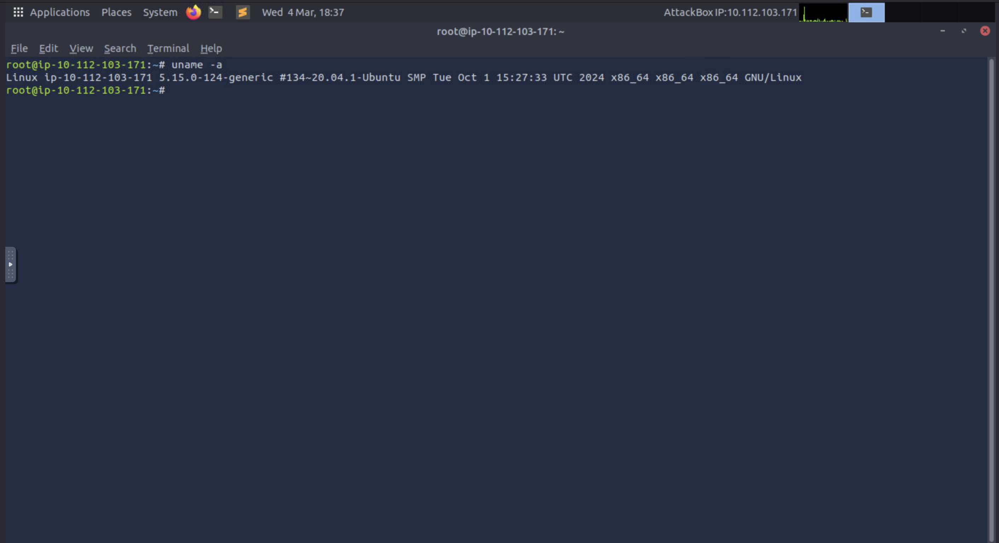
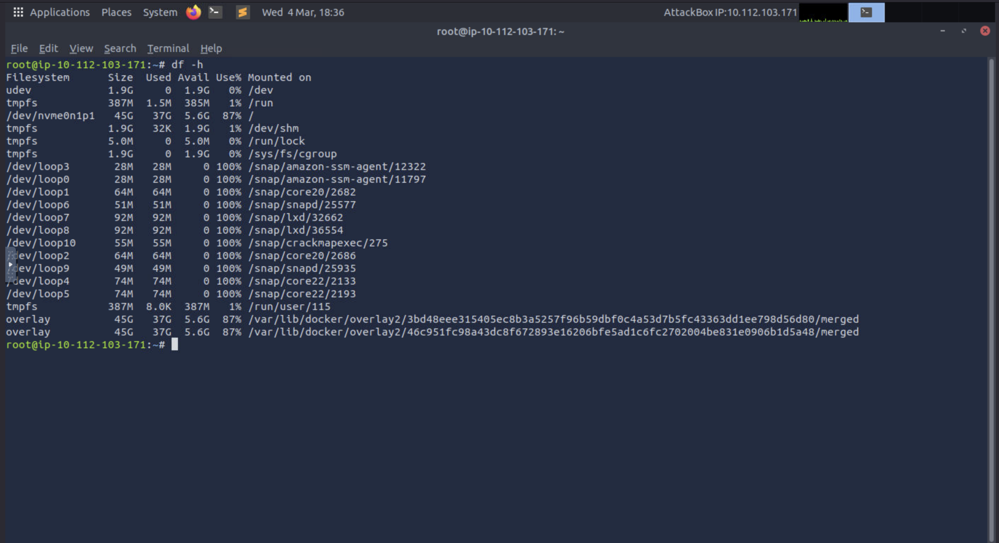
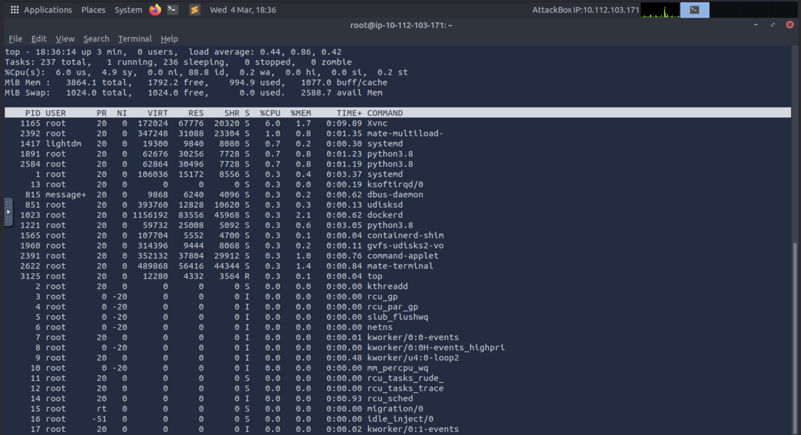
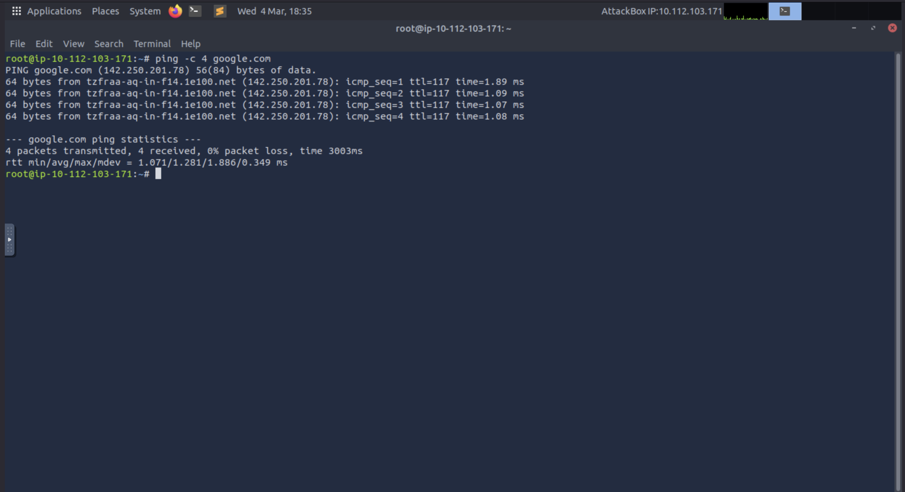

# Linux Support Lab

## Quick Proof (Screenshots)

## Overview
This lab demonstrates basic Linux troubleshooting tasks commonly performed by Tier-1 IT support technicians.

The goal is to show familiarity with Linux command-line diagnostics used to identify system and network issues.

---

## Tools Used
Linux terminal

Commands demonstrated:
- uname
- df
- top
- ping

---

## 1) System Information
Command:
`uname -a`

Purpose:
Displays system kernel version and OS details.

Helpdesk use case:
Verify system version during compatibility troubleshooting.

Screenshot:

---

## 2) Disk Usage
Command:
`df -h`

Purpose:
Displays disk space usage for all mounted drives.

Helpdesk use case:
Identify storage issues / full disks impacting performance.

Screenshot:

---

## 3) Process Monitoring
Command:
`top`

Purpose:
Shows active processes and system resource usage.

Helpdesk use case:
Detect processes consuming excessive CPU or memory.

Screenshot:

---

## 4) Network Connectivity
Command:
`ping -c 4 google.com`

Purpose:
Tests connectivity to an external host.

Helpdesk use case:
Verify internet access / basic network troubleshooting.

Screenshot:

---

## Skills Demonstrated
- Linux command-line troubleshooting
- System diagnostics
- Disk usage analysis
- Network connectivity testing

## Repository Structure
